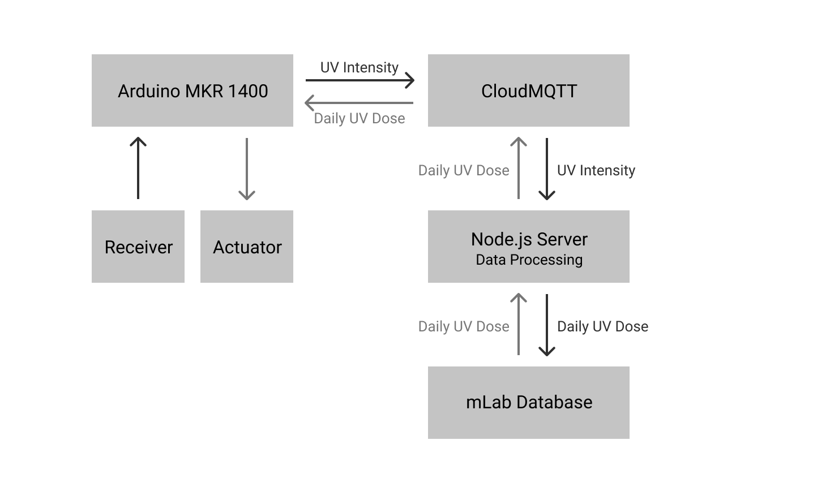
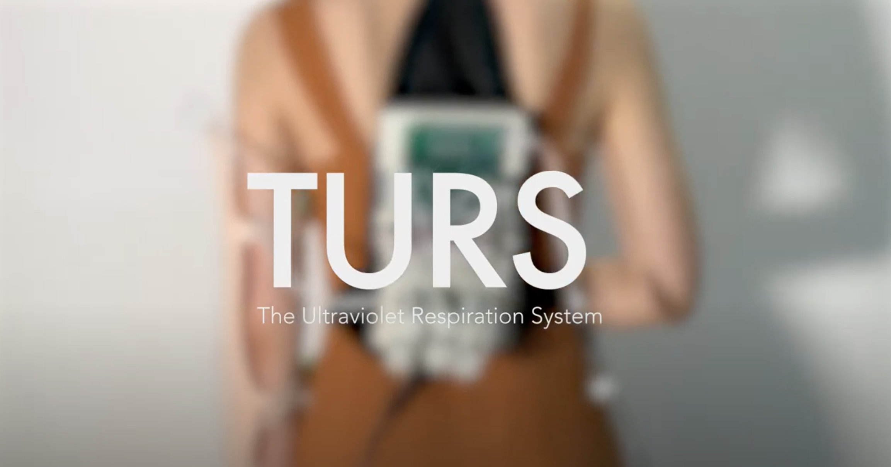

# TURS - The Ultraviolet Respiration System

**Extended Perception 2020**  
Interactive Media Arts, NYU Shanghai  
Jerry, Wang
 
 

## Concept

  

The Ultraviolet Respiration System (TURS) is a human body extension that receives, processes, and reacts to the ultraviolet light radiation. TURS extends human’s perception of an unseen light by encoding technology into the human body. It also explores a form of human-cyborg that enables the wearer to perform special tasks under extreme environments.
  
TURS is designed as a soft robotic system that includes a receiver attached at the user's back and an actuator attached at the arm. The receiver constantly collects the UV intensity, sends the data to the cloud for data processing, and stores the data in the database. The actuator, a soft robotic arm, subscribes to the database and reacts to the data. The soft robotic arm can be inflated and deflated, creating an effect of a breathing skin. The change of the respire rate is a representation of the change of the ultraviolet intensity and the ultraviolet dose.

 

## Inspirations
#### **Inspiration01 -** [Reality Mediators wearable technology by Ling Tan punishes laziness](https://www.dezeen.com/2013/12/09/reality-mediators-wearable-technology-punishes-laziness-ling-tan/)

<table border="0">
  <tr>
     <td width="600"></td>
     <td>Tan's Reality Mediators project hooks up wearable sensors that detect muscle movements, brainwave activity and GPS location with four different devices that cause discomfort to the body. If the wearer stops moving or has a lull in mental activity for too long they will experience either an electric shock, an unpleasant sound, intense heat or irritating vibration.</td>
  </tr>
</table>

#### **Inspiration02 -**  [bioLogic](https://morphingmatter.cs.cmu.edu/second-skin/)

<table border="0">
  <tr>
     <td width="600"></td>
     <td>bioLogic seeks a harmonious perspective, where biological and engineering approaches flow in sync. These animate cells are harvested in a bio lab, assembled by a micron-resolution bio-printing system, and transformed into responsive fashion, a “Second Skin”. We can now observe the self-transforming biological skin activated by living bacteria. The synthetic bio-skin reacts to body heat and sweat, causing flaps around heat zones to open, enabling sweat to evaporate and cool down the body through an organic material flux. In collaboration with New Balance, bioLogic is bringing what once may have lived in the realm of fantasies into the world of sportswear.</td>
  </tr>
</table>

 

## Physical Prototype

<table border="0">
 <tr>
    <td></td>
    <td></td>
    <td></td>
 </tr>
</table>

 

## Network Diagram

The major components in the network includes a receiver encoded with the Arduino MKR GSM 1400, CloudMQTT, Node.js server, and a database backed by mLab. The whole process can be divided into the upward process and the downward process.

  

 

The upward process updates the database with the latest UV intensity. The receiver constantly collects the UV radiation and passes the data to CloudMQTT. The Node.js server subscribes to the CouldMQTT and executes the data processing when receiving new data. After the data processing, the Node.js server stores the data on the database for the downward process.

The downward process updates the Arduino MKR GSM 1400 with the latest data whenever Arduino restarts. The Node.js server obtains the data from the database, encodes it to a readable form for Arduino, and sends the data to Arduino using MQTT. After the Arduino received the data, it actuates the robotic arm.

 

## Code

The network is achieved by a heavy interchange of data between the local receiver and the database using CloudMQTT and Node.js server as the data intermediate. The receiver is encoded in Arduino, which includes the code for both MQTT communication and the actuator control. As the data intermediate, the Node.js server connects the database and the Arduino by sending data back and forth to the CloudMQTT. It's also where the data processing happens.

<table border="0">
 <tr>
    <td></td>
    <td></td>
 </tr>
</table>

 

## Presentation

  

Here is the [presentation](https://drive.google.com/file/d/1sPQjfbqbn5Cp4C4C8AliDUMtFgdsY01L/view?usp=sharing) of the final implementation.

 

## Final Implementation

  

Here is the [video](https://www.youtube.com/watch?v=Z9AGKCLCHhQ) of the final implementation.

 

## References

* [Markdown Cheatsheet](https://github.com/adam-p/markdown-here/wiki/Markdown-Cheatsheet)
* [The Creators Project](https://www.vice.com/en_us/topic/the-creators-project)
* [CreativeApplications.net](https://www.creativeapplications.net/)
* [Prix Ars Electronica](https://ars.electronica.art/prix/en/categories/interactive-art/)
* [Interactive Architecture Lab](http://www.interactivearchitecture.org/)
* [Furl: Soft Pneumatic Pavilion](http://www.interactivearchitecture.org/lab-projects/furl-soft-pneumatic-pavilion)
* [A wearable soft robot with variable material distribution](http://www.interactivearchitecture.org/a-wearable-soft-robot-with-variable-material-distribution.html)
* [Reality Mediators wearable technology by Ling Tan punishes laziness](https://www.dezeen.com/2013/12/09/reality-mediators-wearable-technology-punishes-laziness-ling-tan/)
* [BioLogic](https://morphingmatter.cs.cmu.edu/second-skin/)
